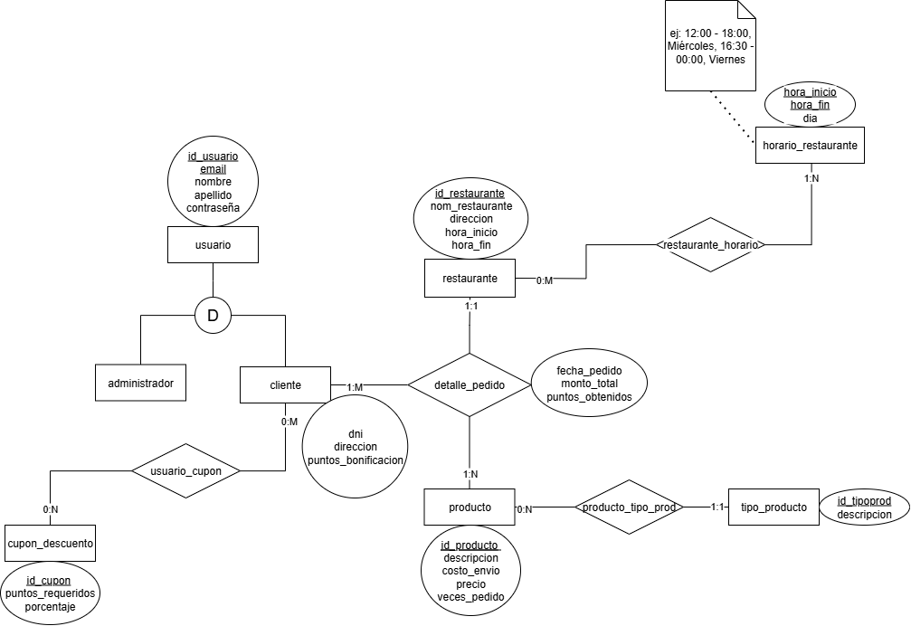

# TP JAVA - Delivery
 

## Integrantes
 

*   Filippini, Santiago - 54140
     
*   De Giorgi, Juan Ignacio - 54007
     

---
 

## Enunciado General - Descripción del Negocio
 
El sistema se trata de una aplicación web semejante a plataformas de pedidos de comida a domicilio, similar a servicios como  *PedidosYa* . Provee a los usuarios un espacio para realizar pedidos a todo restaurante de la ciudad que se encuentre registrado en la plataforma, mostrando las diversas opciones disponibles según los horarios de los restaurantes y los productos que estos tienen para ofrecer.
 
Los pedidos, realizados por los usuarios, se gestionan desde su creación hasta su entrega, incluyendo validaciones como disponibilidad del restaurante, cálculo del tiempo estimado de entrega en función de la distancia entre el cliente y el comercio, e información acerca del estado actual del pedido a lo largo de todo el proceso, para garantizar la confianza del cliente.
 

## Modelo de Datos

## Alcance Funcional - Regularidad

| Requerimiento | **Detalle/Listado de casos incluidos** |
| ------------- | -------------------------------------- |
| ABMC simple | 1 CRUD Usuario (admin/cliente) 2. CRUD Horario Restaurante 3. CRUD Tipo_Producto |
| ABMC dependiente | CRUD Producto {depende de} Tipo_Producto CRUD Restaurante {depende de} Horario_Restaurante |
| CU NO-ABMC | 1. Realizar Pedido |
| Listado simple | Listado de todos los restaurantes de la plataforma |

## Alcance Funcional - Aprobación Directa

<table><tbody><tr><th >Requerimiento</th><th >Detalle/Listado de casos incluidos</th></tr><tr><td >ABMC</td><td >1. CRUD horario_restaurante 2. CRUD restaurante 3. CRUD producto 4. CRUD cupon_descuento 5. CRUD tipo_producto 6. CRUD usuario</td></tr><tr><td >CU "Complejo"(nivel resumen)</td><td >Realizar pedido</td></tr><tr><td >Listado complejo</td><td >Productos por tipo, Productos por numero de veces pedido</td></tr><tr><td >Nivel de acceso</td><td >1. Invitado 2. Cliente 3. Administrador</td></tr><tr><td >Manejo de errores</td><td >No requiere detalle</td></tr><tr><td >Publicar el sitio</td><td >No requiere detalle</td></tr></tbody></table>

## Requerimientos extra - AD

<table><tbody><tr><th >Requerimiento</th><th >**Detalle/Listado de casos incluidos**</th></tr><tr><td >Manejo de archivos</td><td ></td></tr><tr><td >Custom exceptions</td><td ></td></tr><tr><td >Log de errores</td><td ></td></tr><tr><td >Envio de emails</td><td ></td></tr></tbody></table>

